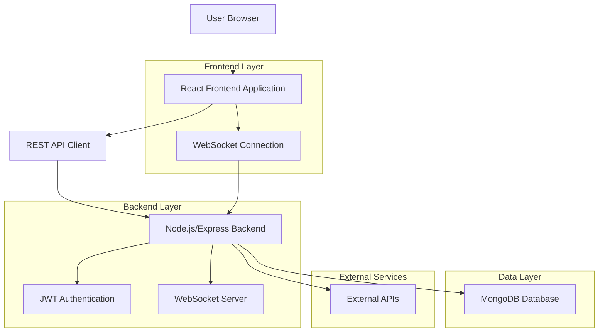
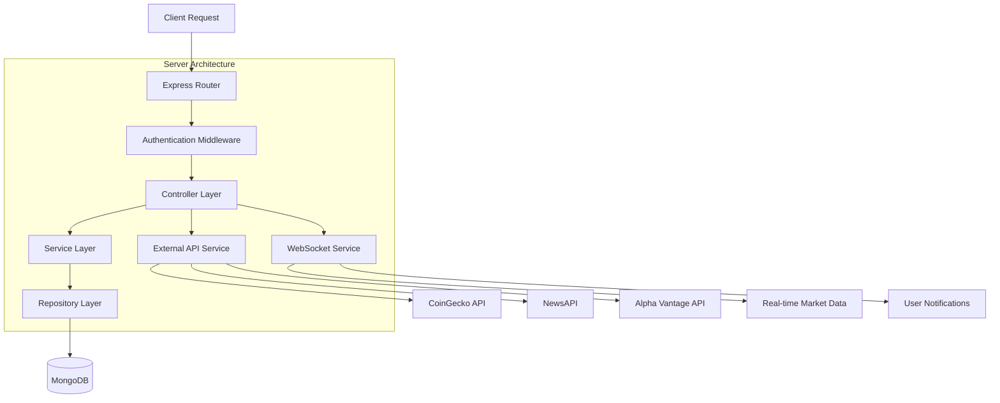
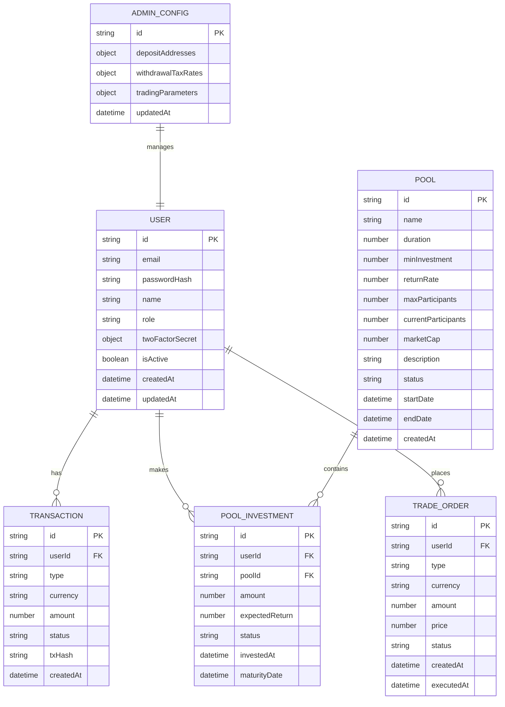

# Crypto Trading Platform - Technical Architecture Document

## 1. Architecture Design



## 2. Technology Description

* **Frontend**: React\@18 + Vite\@4 + Tailwind CSS\@3 + Socket.io-client\@4

* **Backend**: Node.js\@18 + Express\@4 + Socket.io\@4 + Mongoose\@7

* **Database**: MongoDB\@6 with Mongoose ODM

* **Authentication**: JWT + Speakeasy (2FA) + bcrypt

* **Real-time**: WebSocket (Socket.io) for market data and notifications

* **External APIs**: CoinGecko API, NewsAPI, Alpha Vantage (for stocks)

## 3. Route Definitions

| Route     | Purpose                                                    |
| --------- | ---------------------------------------------------------- |
| /         | Dashboard page with market data and news feed              |
| /home     | Enhanced dashboard with navigation menu                    |
| /assets   | Asset management page with balance and transaction history |
| /deposit  | Cryptocurrency deposit page with addresses                 |
| /withdraw | Withdrawal page with tax calculations                      |
| /pools    | Investment pools page for users                            |
| /trade    | Trading interface for BTC and other cryptocurrencies       |
| /admin    | Admin panel for platform configuration                     |
| /login    | User authentication page                                   |
| /register | User registration with 2FA setup                           |
| /history  | Detailed transaction history                               |
| /staking  | Staking management page                                    |
| /loans    | Loan management interface                                  |
| /support  | Customer support and help center                           |

## 4. API Definitions

### 4.1 Authentication APIs

**User Registration**

```
POST /api/auth/register
```

Request:

| Param Name | Param Type | isRequired | Description                      |
| ---------- | ---------- | ---------- | -------------------------------- |
| email      | string     | true       | User email address               |
| password   | string     | true       | User password (min 8 characters) |
| name       | string     | true       | User full name                   |

Response:

| Param Name | Param Type | Description              |
| ---------- | ---------- | ------------------------ |
| success    | boolean    | Registration status      |
| message    | string     | Success or error message |
| qrCode     | string     | 2FA QR code for setup    |

**User Login**

```
POST /api/auth/login
```

Request:

| Param Name    | Param Type | isRequired | Description           |
| ------------- | ---------- | ---------- | --------------------- |
| email         | string     | true       | User email            |
| password      | string     | true       | User password         |
| twoFactorCode | string     | true       | 2FA verification code |

Response:

| Param Name | Param Type | Description       |
| ---------- | ---------- | ----------------- |
| success    | boolean    | Login status      |
| token      | string     | JWT access token  |
| user       | object     | User profile data |

### 4.2 Asset Management APIs

**Get User Balance**

```
GET /api/assets/balance
```

Response:

| Param Name       | Param Type | Description                       |
| ---------------- | ---------- | --------------------------------- |
| totalBalance     | number     | Total balance in USD              |
| availableBalance | number     | Available balance for trading     |
| lockedBalance    | number     | Locked balance in staking/trading |
| balances         | array      | Balance breakdown by currency     |

**Get Transaction History**

```
GET /api/assets/transactions
```

Query Parameters:

| Param Name | Param Type | isRequired | Description                  |
| ---------- | ---------- | ---------- | ---------------------------- |
| page       | number     | false      | Page number (default: 1)     |
| limit      | number     | false      | Items per page (default: 20) |
| type       | string     | false      | Transaction type filter      |

### 4.3 Deposit/Withdrawal APIs

**Get Deposit Address**

```
GET /api/deposit/address/:currency
```

Response:

| Param Name | Param Type | Description                            |
| ---------- | ---------- | -------------------------------------- |
| address    | string     | Deposit address for specified currency |
| qrCode     | string     | QR code for the address                |
| currency   | string     | Currency type (BTC, ETH, TRC20)        |

**Create Withdrawal Request**

```
POST /api/withdraw/request
```

Request:

| Param Name | Param Type | isRequired | Description          |
| ---------- | ---------- | ---------- | -------------------- |
| currency   | string     | true       | Currency to withdraw |
| amount     | number     | true       | Withdrawal amount    |
| address    | string     | true       | Destination address  |

### 4.4 Pool Management APIs

**Get Available Pools**

```
GET /api/pools
```

Response:

| Param Name | Param Type | Description                        |
| ---------- | ---------- | ---------------------------------- |
| pools      | array      | List of available investment pools |

**Join Investment Pool**

```
POST /api/pools/join
```

Request:

| Param Name | Param Type | isRequired | Description       |
| ---------- | ---------- | ---------- | ----------------- |
| poolId     | string     | true       | Pool identifier   |
| amount     | number     | true       | Investment amount |

### 4.5 Trading APIs

**Place Trade Order**

```
POST /api/trade/order
```

Request:

| Param Name | Param Type | isRequired | Description            |
| ---------- | ---------- | ---------- | ---------------------- |
| type       | string     | true       | Order type (buy/sell)  |
| currency   | string     | true       | Trading currency       |
| amount     | number     | true       | Trade amount           |
| price      | number     | false      | Limit price (optional) |

### 4.6 Admin APIs

**Update Deposit Addresses**

```
PUT /api/admin/addresses
```

Request:

| Param Name | Param Type | isRequired | Description         |
| ---------- | ---------- | ---------- | ------------------- |
| currency   | string     | true       | Currency type       |
| address    | string     | true       | New deposit address |

**Create Investment Pool**

```
POST /api/admin/pools
```

Request:

| Param Name      | Param Type | isRequired | Description               |
| --------------- | ---------- | ---------- | ------------------------- |
| name            | string     | true       | Pool name                 |
| duration        | number     | true       | Duration in days          |
| minInvestment   | number     | true       | Minimum investment amount |
| returnRate      | number     | true       | Expected return rate (%)  |
| maxParticipants | number     | true       | Maximum participants      |
| marketCap       | number     | true       | Total pool market cap     |
| description     | string     | true       | Pool description          |

## 5. Server Architecture Diagram



## 6. Data Model

### 6.1 Data Model Definition



### 6.2 Data Definition Language

**User Collection**

```javascript
// User Schema
const userSchema = new mongoose.Schema({
  email: { type: String, required: true, unique: true },
  passwordHash: { type: String, required: true },
  name: { type: String, required: true },
  role: { type: String, enum: ['user', 'admin'], default: 'user' },
  twoFactorSecret: {
    secret: String,
    isEnabled: { type: Boolean, default: false }
  },
  balances: {
    BTC: { type: Number, default: 0 },
    ETH: { type: Number, default: 0 },
    TRC20: { type: Number, default: 0 },
    USD: { type: Number, default: 0 }
  },
  isActive: { type: Boolean, default: true },
  createdAt: { type: Date, default: Date.now },
  updatedAt: { type: Date, default: Date.now }
});

// Indexes
userSchema.index({ email: 1 });
userSchema.index({ createdAt: -1 });
```

**Transaction Collection**

```javascript
// Transaction Schema
const transactionSchema = new mongoose.Schema({
  userId: { type: mongoose.Schema.Types.ObjectId, ref: 'User', required: true },
  type: { type: String, enum: ['deposit', 'withdrawal', 'trade', 'staking', 'pool_investment'], required: true },
  currency: { type: String, enum: ['BTC', 'ETH', 'TRC20', 'USD'], required: true },
  amount: { type: Number, required: true },
  fee: { type: Number, default: 0 },
  status: { type: String, enum: ['pending', 'completed', 'failed', 'cancelled'], default: 'pending' },
  txHash: String,
  fromAddress: String,
  toAddress: String,
  metadata: mongoose.Schema.Types.Mixed,
  createdAt: { type: Date, default: Date.now },
  updatedAt: { type: Date, default: Date.now }
});

// Indexes
transactionSchema.index({ userId: 1, createdAt: -1 });
transactionSchema.index({ status: 1 });
transactionSchema.index({ type: 1 });
```

**Pool Collection**

```javascript
// Pool Schema
const poolSchema = new mongoose.Schema({
  name: { type: String, required: true },
  duration: { type: Number, required: true }, // in days
  minInvestment: { type: Number, required: true },
  returnRate: { type: Number, required: true }, // percentage
  maxParticipants: { type: Number, required: true },
  currentParticipants: { type: Number, default: 0 },
  marketCap: { type: Number, required: true },
  currentInvestment: { type: Number, default: 0 },
  description: { type: String, required: true },
  status: { type: String, enum: ['active', 'closed', 'matured'], default: 'active' },
  startDate: { type: Date, default: Date.now },
  endDate: Date,
  createdBy: { type: mongoose.Schema.Types.ObjectId, ref: 'User', required: true },
  createdAt: { type: Date, default: Date.now },
  updatedAt: { type: Date, default: Date.now }
});

// Indexes
poolSchema.index({ status: 1 });
poolSchema.index({ endDate: 1 });
poolSchema.index({ createdAt: -1 });
```

**Admin Configuration Collection**

```javascript
// Admin Config Schema
const adminConfigSchema = new mongoose.Schema({
  depositAddresses: {
    BTC: { type: String, required: true },
    ETH: { type: String, required: true },
    TRC20: { type: String, required: true }
  },
  withdrawalTaxRates: {
    BTC: { type: Number, default: 0.001 },
    ETH: { type: Number, default: 0.002 },
    TRC20: { type: Number, default: 0.001 }
  },
  tradingParameters: {
    profitThreshold: { type: Number, default: 0.05 }, // 5%
    lossThreshold: { type: Number, default: 0.03 }, // 3%
    maxTradeAmount: { type: Number, default: 10000 },
    tradingFee: { type: Number, default: 0.001 } // 0.1%
  },
  updatedAt: { type: Date, default: Date.now }
});

// Single document collection
adminConfigSchema.index({ _id: 1 }, { unique: true });
```

**Initial Data**

```javascript
// Initial Admin Configuration
const initialAdminConfig = {
  depositAddresses: {
    BTC: "1A1zP1eP5QGefi2DMPTfTL5SLmv7DivfNa",
    ETH: "0x742d35Cc6634C0532925a3b8D4C9db96590645d8",
    TRC20: "TLa2f6VPqDgRE67v1736s7bJ8Ray5wYjU7"
  },
  withdrawalTaxRates: {
    BTC: 0.001,
    ETH: 0.002,
    TRC20: 0.001
  },
  tradingParameters: {
    profitThreshold: 0.05,
    lossThreshold: 0.03,
    maxTradeAmount: 10000,
    tradingFee: 0.001
  }
};

// Sample Investment Pool
const samplePool = {
  name: "Bitcoin Growth Pool",
  duration: 30,
  minInvestment: 100,
  returnRate: 15,
  maxParticipants: 100,
  marketCap: 50000,
  description: "A 30-day Bitcoin investment pool with 15% expected returns",
  status: "active"
};
```

