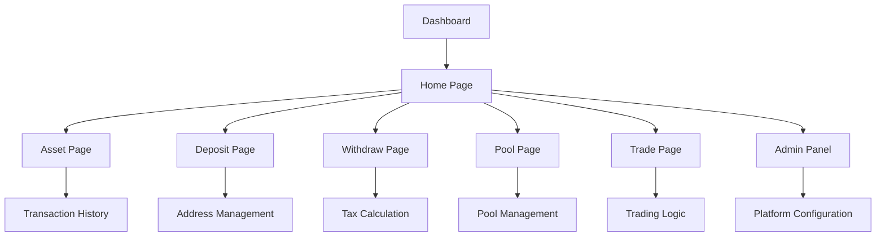

# Crypto Trading Platform - Product Requirements Document

## 1. Product Overview
A comprehensive full-stack crypto trading platform that provides real-time market data, asset management, trading capabilities, and investment pools with administrative controls.

The platform serves both regular users seeking to trade cryptocurrencies and manage their digital assets, and administrators who need to configure platform settings, manage pools, and oversee operations. The solution addresses the need for a unified platform that combines real-time market insights, secure trading, and flexible investment opportunities.

Target market: Cryptocurrency traders, investors, and financial institutions seeking a robust trading and investment management platform.

## 2. Core Features

### 2.1 User Roles
| Role | Registration Method | Core Permissions |
|------|---------------------|------------------|
| Regular User | Email registration with 2FA | Can trade, deposit, withdraw, view balances, participate in pools |
| Admin User | Admin invitation with elevated 2FA | Can manage pools, configure taxes, set trading parameters, manage deposit addresses |

### 2.2 Feature Module
Our crypto trading platform consists of the following main pages:
1. **Dashboard**: Real-time market prices (Crypto/NFT/Stocks), live news feed, platform benefits section, partner logos footer.
2. **Home Page**: Enhanced dashboard with navigation menu (Asset, History, Staking, Loan, Trade, Whitepaper, Support).
3. **Asset Page**: Total balance display, available balance with actions (Withdraw, Trade, Stake), locked funds section, transaction history.
4. **Deposit Page**: Multi-currency deposit support (BTC, ETH, TRC20) with admin-configurable addresses.
5. **Withdraw Page**: Multi-currency withdrawal with tax calculations and admin-configurable rates.
6. **Pool Page**: Investment pool management with admin-created pools and automatic return distribution.
7. **Trade Page**: BTC trading interface with configurable profit/loss logic.
8. **Admin Panel**: Platform configuration for addresses, pools, taxes, and trading parameters.

### 2.3 Page Details
| Page Name | Module Name | Feature description |
|-----------|-------------|---------------------|
| Dashboard | Market Data Tabs | Display real-time prices for Crypto, NFTs, and Stocks with switchable tabs |
| Dashboard | News Feed | Show live crypto and blockchain news with auto-refresh |
| Dashboard | Why Us Section | List platform benefits and competitive advantages |
| Dashboard | Partner Footer | Display partner company logos in footer section |
| Home Page | Navigation Menu | App logo opens menu with Asset, History, Staking, Loan, Trade, Whitepaper, Support options |
| Home Page | Enhanced Dashboard | Include all dashboard features plus additional navigation capabilities |
| Asset Page | Balance Overview | Show total balance with clear visual representation |
| Asset Page | Available Balance | Display available funds with Withdraw, Trade, Stake action buttons |
| Asset Page | Locked Funds | Show funds locked in staking or trading positions |
| Asset Page | Transaction History | Complete transaction log with filtering and pagination |
| Deposit Page | Multi-Currency Support | Accept BTC, ETH, TRC20 deposits with unique addresses |
| Deposit Page | Address Management | Admin-editable deposit addresses for each currency |
| Withdraw Page | Multi-Currency Withdrawal | Support BTC, ETH, TRC20 withdrawals with validation |
| Withdraw Page | Tax Calculation | Apply configurable tax rates before processing withdrawals |
| Withdraw Page | Pending System | Queue withdrawals until sufficient balance (including tax) is available |
| Pool Page | Pool Creation | Admin can create pools with name, duration, min investment, return rate, participants limit, market cap, description |
| Pool Page | Pool Management | Edit existing pools and manage participant enrollment |
| Pool Page | Return Distribution | Automatically add returns to user balances after pool maturity |
| Trade Page | BTC Trading | Default BTC trading interface with buy/sell capabilities |
| Trade Page | Position Logic | Implement buy/sell decisions based on admin-configured profit/loss settings |
| Admin Panel | Address Configuration | Manage deposit addresses for all supported cryptocurrencies |
| Admin Panel | Pool Management | Create, edit, and monitor investment pools |
| Admin Panel | Tax Settings | Configure withdrawal tax rates and trading fees |
| Admin Panel | Trading Parameters | Set profit/loss thresholds and trading logic parameters |

## 3. Core Process

**Regular User Flow:**
1. User registers with email and sets up 2FA
2. User accesses dashboard to view market data and news
3. User navigates to deposit page and transfers funds using provided addresses
4. User can trade on the trading page or participate in investment pools
5. User monitors assets and transaction history on the asset page
6. User can withdraw funds through the withdrawal system with tax calculations

**Admin Flow:**
1. Admin logs in with elevated 2FA authentication
2. Admin accesses admin panel to configure platform settings
3. Admin creates and manages investment pools with specific parameters
4. Admin sets tax rates and trading logic parameters
5. Admin monitors platform activity and user transactions
6. Admin updates deposit addresses and manages pool returns

## 4. User Interface Design

### 4.1 Design Style
- **Primary Colors**: Deep blue (#1e3a8a) and gold (#f59e0b) for professional crypto aesthetic
- **Secondary Colors**: Dark gray (#374151) and light gray (#f3f4f6) for backgrounds
- **Button Style**: Rounded corners with gradient effects and hover animations
- **Font**: Inter or Roboto for clean, modern readability with 14px base size
- **Layout Style**: Card-based design with top navigation and sidebar for admin functions
- **Icons**: Cryptocurrency-themed icons with consistent sizing and modern outline style

### 4.2 Page Design Overview
| Page Name | Module Name | UI Elements |
|-----------|-------------|-------------|
| Dashboard | Market Data Tabs | Tabbed interface with color-coded price changes, charts, and real-time updates |
| Dashboard | News Feed | Card-based news items with thumbnails, timestamps, and smooth scrolling |
| Dashboard | Why Us Section | Icon-based feature grid with hover effects and benefit descriptions |
| Dashboard | Partner Footer | Logo carousel with grayscale to color hover transitions |
| Home Page | Navigation Menu | Slide-out menu with animated icons and organized sections |
| Asset Page | Balance Overview | Large balance display with currency symbols and percentage changes |
| Asset Page | Available Balance | Action buttons with distinct colors (green for stake, blue for trade, red for withdraw) |
| Asset Page | Transaction History | Table with sortable columns, status indicators, and pagination controls |
| Deposit Page | Address Display | QR code generation with copy-to-clipboard functionality |
| Withdraw Page | Form Interface | Step-by-step wizard with validation and tax calculation preview |
| Pool Page | Pool Cards | Grid layout with investment details, progress bars, and join buttons |
| Trade Page | Trading Interface | Chart integration with buy/sell panels and order book display |
| Admin Panel | Configuration Forms | Organized tabs with form validation and real-time preview |

### 4.3 Responsiveness
The platform is designed mobile-first with responsive breakpoints at 768px (tablet) and 1024px (desktop). Touch interactions are optimized for mobile trading with larger buttons and swipe gestures for chart navigation. Desktop version includes advanced features like multi-chart views and detailed admin controls.